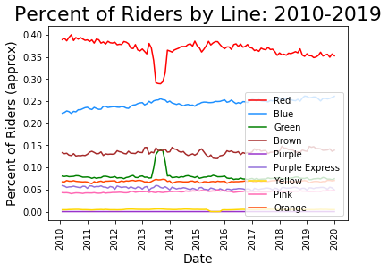
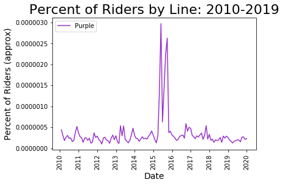

## Analysis of 'L' Ridership by line

Using open transit data from the CTA [(Data)](https://data.cityofchicago.org/Transportation/CTA-Ridership-L-Station-Entries-Daily-Totals/5neh-572f). We analyze trends in ridership on the Chicago transit system brokendown by 'L' line. We are particularly interested in changes in trends during the March 2020 to present time period.

### Approximating ridership by line

The CTA records the number of riders entering stations and the data reports these totals daily. A number of stations are served by multiple line (for example Belmont is served by the Red, Brown, and Purple line express). We thus have no a priori way of knowing how many of the riders who checked into the Belmont station took a Red line train. To circumvent this gap in the data we approximate ridership on each line. 

Our approximation is based on a iterative approach. In which we specify a distribution which describes the probability that a rider at a statin will use each line. Using this distribution we compute total ridership on each line for each day. We then use this aggregated data to update our distribution. In our analysis we intialized the procedure using a uniform distribution and took 10 iterations. We expect other choices of approximation methods to yeild similar results.

### Ridership by line 2010 - 2020

This chart shows that overall the proportion of ridership on each line has been realtively stable over time. From the graph we can see a significant exception is in 2013-2014 in which the Red line experiences a decease in riderhsip and the Green line a significant increase. We atrribute this to the closure of several Red line stations serving the south side of Chicago [(link)](https://www.transitchicago.com/redsouth/).

To get a beter sense of Purple and Yellow line ridership we can plot those on their own charts:

Again we notice a significant deviation in 2015. We attribute this the closure of yellow line stations [(link)](https://en.wikipedia.org/wiki/Yellow_Line_(CTA)#2015_embankment_collapse).

To visualize a typical yearly breakdown of ridership we used to 2018:

### Ridership by line 2020

We can see from this graph the change in trends which take place in March 2020. During that month the state of Illinois was placed under a stay at home order due the spread of COVID-19. In particualr we observe a higher propotion of riders taking the Red, Green and Pink lines and a lower proportion taking the Brown line. We can see these chagnes in trend more clearly in the following charts:

From these final two charts we can see that the Yellow and Purple lines also experienced an increase in proportional ridership.

